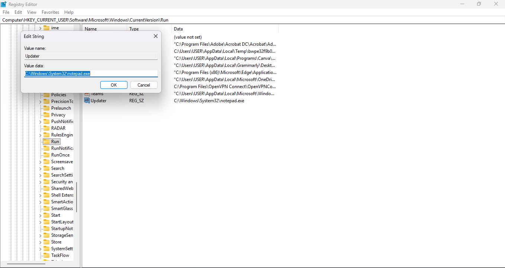
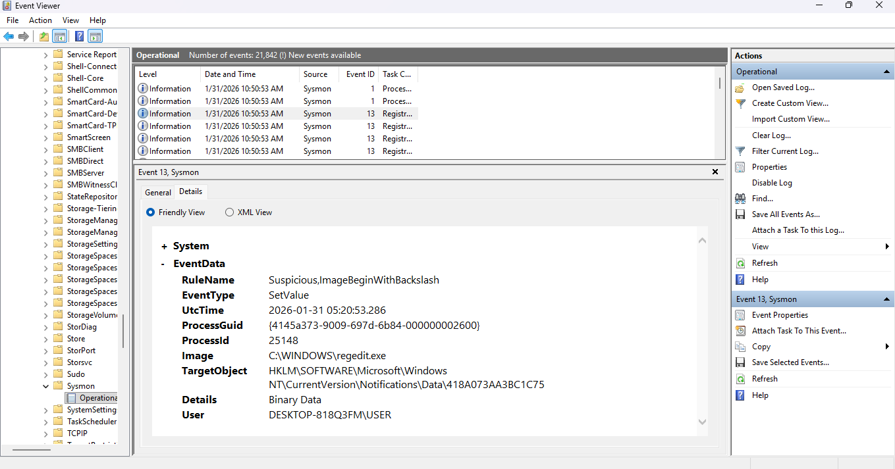
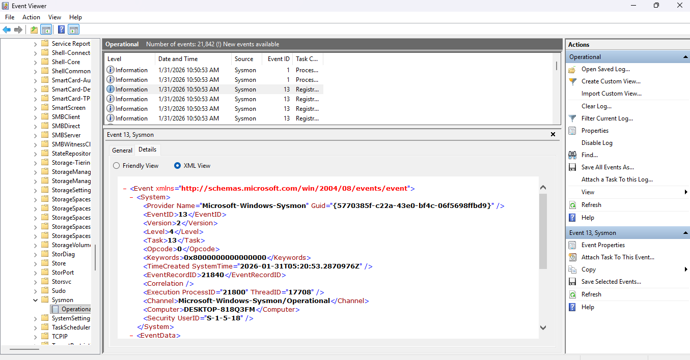

# 🛡️ Windows Persistence Detection & Sysmon Analysis

## 📌 Project Overview
This project demonstrates how to detect **Adversary Persistence** techniques specifically **Registry Run Key** modifications using **Microsoft Sysmon**. This lab bridges the gap between offensive simulation and defensive detection, a core responsibility of a Cybersecurity Engineer.

---

## 🛠️ Technologies & Tools
* **Operating System:** Windows 10/11
* **Telemetry Source:** Microsoft Sysmon (Hardened Config by SwiftOnSecurity)
* **Analysis Tool:** Windows Event Viewer
* **Attack Technique:** MITRE ATT&CK T1547.001 (Registry Run Keys)

---

## 🎯 Phase 2: Detecting Persistence (Registry Run Keys)
In this phase, I simulated a common post-exploitation technique called **Persistence**. Attackers often use the Windows Registry to ensure their malware executes automatically upon system reboot.

### 🛠️ Simulation Steps:
1. **Registry Access:** Navigated to `HKCU\Software\Microsoft\Windows\CurrentVersion\Run` using Registry Editor.
2. **Payload Injection:** Created a new string value named `Updater`.
3. **Execution Path:** Assigned a mock malicious payload path (`C:\Windows\System32\notepad.exe`) to the key.

*Figure 1: Injecting a mock malicious payload into the Registry Run keys.*

4. **Monitoring:** Observed Sysmon's real-time detection capabilities via Event Viewer.

---

## 🔍 Detection Results & Findings

### 🛡️ Sysmon Event ID 13: RegistryEvent (Value Set)
The modification was successfully captured by Sysmon. Below are the key artifacts analyzed:

*Figure 2: Sysmon capturing the Registry Value Set (Event ID 13).*

* **Event ID:** 13 (Registry Value Set)
* **Rule Match:** The event was flagged as **`Suspicious`** by the hardened Sysmon configuration.
* **Process Image:** Identified `C:\WINDOWS\regedit.exe` as the source of the modification.
* **TargetObject:** `HKCU\Software\Microsoft\Windows\CurrentVersion\Run\Updater`
* **Details:** Captured the exact payload path added to the registry.

*Figure 3: Deep dive into the log artifacts including Process ID and User details.*

---

## 💡 Engineering Insights
* **Deep Visibility:** Standard Windows event logs often miss granular registry changes. Sysmon provides the necessary visibility to catch "silent" persistence.
* **Context Matters:** By capturing the **Process Image** and **User**, we can distinguish between legitimate software updates and unauthorized manual modifications.
* **Proactive Defense:** Understanding these artifacts allows an engineer to create automated alerts in a SIEM like **Splunk**.

---

## 🏁 Conclusion
This lab successfully demonstrates the ability to monitor, detect, and analyze post-exploitation activities. Understanding how attackers hide in the registry is vital for building robust detection rules in a SOC environment.
